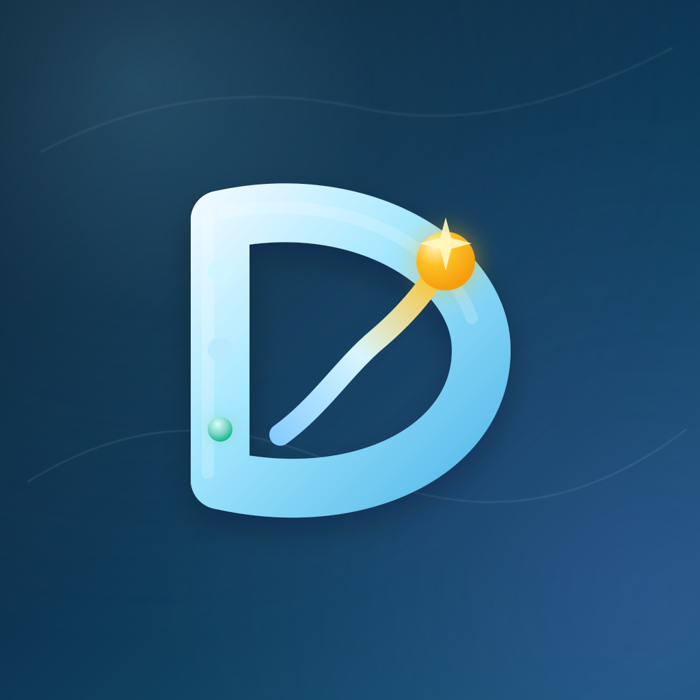

<p align="center">
  
</p>

<h1 align="center">Dayline</h1>

<p align="center">
  A personal daily dashboard for iPhone and Mac — to-dos, bookmarks and reminders,<br>
  synced in real time to a server you run yourself. Save links from any app with the Share sheet.
</p>

## Install with SideStore / AltStore

Add this source URL:

```
https://raw.githubusercontent.com/nirobhaq/dayline-store/main/store.json
```

Then install **Dayline** and choose **Keep App Extensions (Use Main Profile)** so the share extension works.
Updates arrive automatically. Release notes are on the [Releases](https://github.com/nirobhaq/dayline-store/releases) page.
